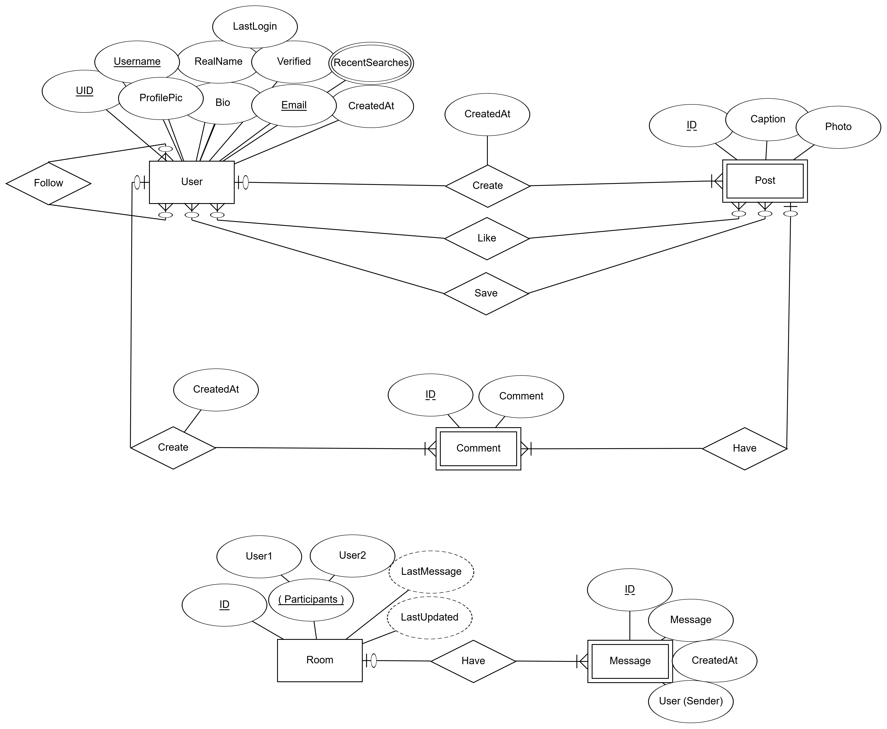

# Instadicey (Backend)
This is the backend section of the fullstack Instagram clone project (Instadicey)

Made with ASP.NET Core and Microsoft SQL Server

# ERD
The entity relationship diagram of the app, which shows an overview of the entities that compose the app, and how they can interact with eachother (relationships), in addition to any attributes each entity may have.

This does not accurately represent the technical side of the database fully, but it's meant to show how the planning of the app's structure.

This ERD was made using [ERDPlus](https://erdplus.com/).

# Features
✅ SQL Server - Data storage

✅ JWT tokens - Generates and validates JWTs to use for authentication

✅ ASP.NET Identity - Account management (authorization, authentication)

✅ Email verification - Used SendGrid with Identity to send verification emails (for sign up)

✅ Problem Details - Error responses follow problem details RFC 7807 specifications